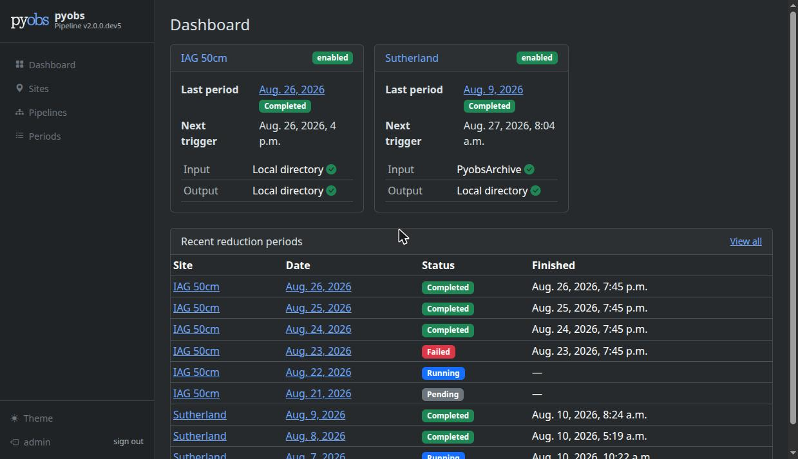
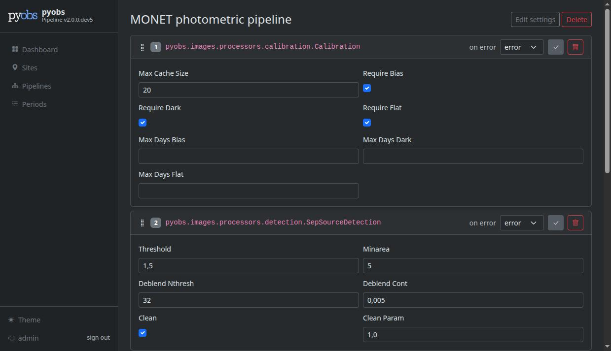
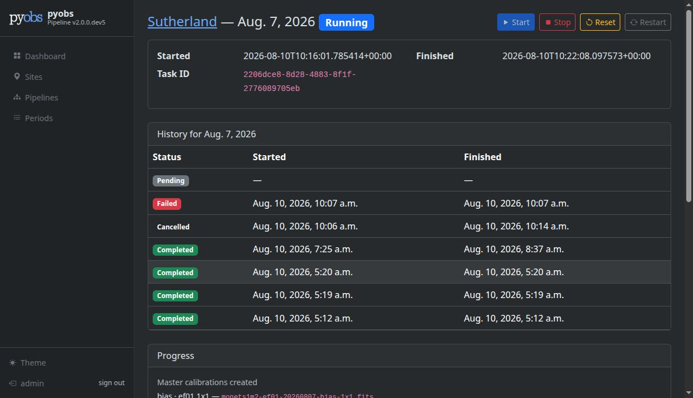
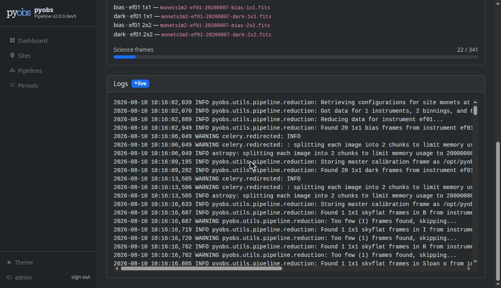

pyobs-pipeline
##############

Web-based monitoring and configuration for pyobs data reduction pipelines: monitor status, view
logs, retrigger reduction periods, and configure pipeline steps through a guided builder,
replacing SSH + manual YAML editing.

No REST API beyond one small JSON status-polling endpoint (see :doc:`architecture`) — this is a
server-rendered Django app, not a client/API split like pyobs-portal or pyobs-archive.

Screenshots
===========

Dashboard, with one card per site:

         trigger, and input/output status, plus a table of recent reduction periods across all
         statuses.
   :width: 100%

The guided pipeline builder, introspecting a pyobs-core processor class's constructor into a
form:

         parameters as form fields.
   :width: 100%

A reduction period's run history, manual controls, live progress, and live-tailing log viewer:

         past runs for that date.
   :width: 100%

         frame count) and a live log viewer.
   :width: 100%

.. toctree::
   :maxdepth: 1

   installation
   configuration
   architecture
   development
